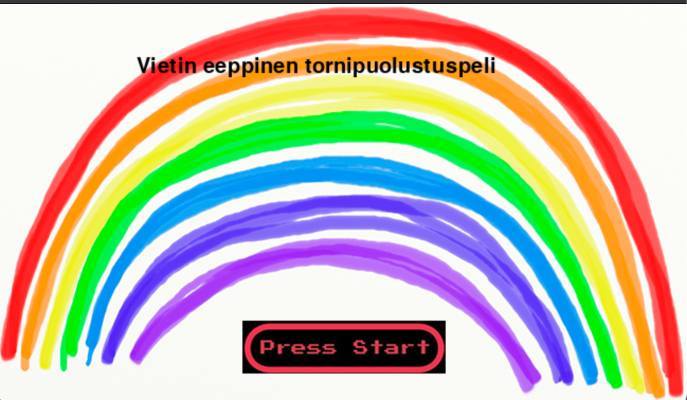
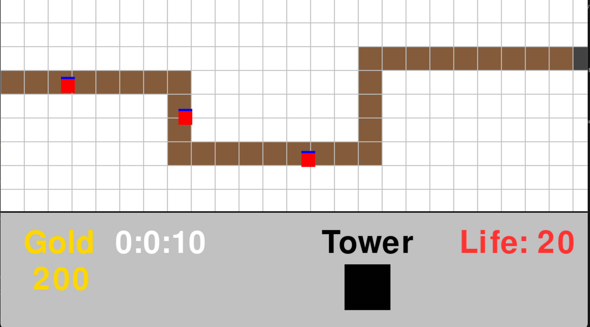

# Tower Defense

Software project created in CS-A1121 Ohjelmoinnin peruskurssi Y2 with Python3 by me.

## Map

## Monsters
Monsters are made from tiles created by Pygame library. Monsters move a fixed path and they get bulkier by time. One monster is worth 20 gold.

## Tower
Towers cost 20 Gold and they don't use the common projectile but damages the monsters using an instantenous laser.

## GUI
GUI shows your current gold balance, time occurred, life left and clicking on tower you can purchase it. After clicking the black square, you place the tower by clicking an available spot which is in this case a white square.